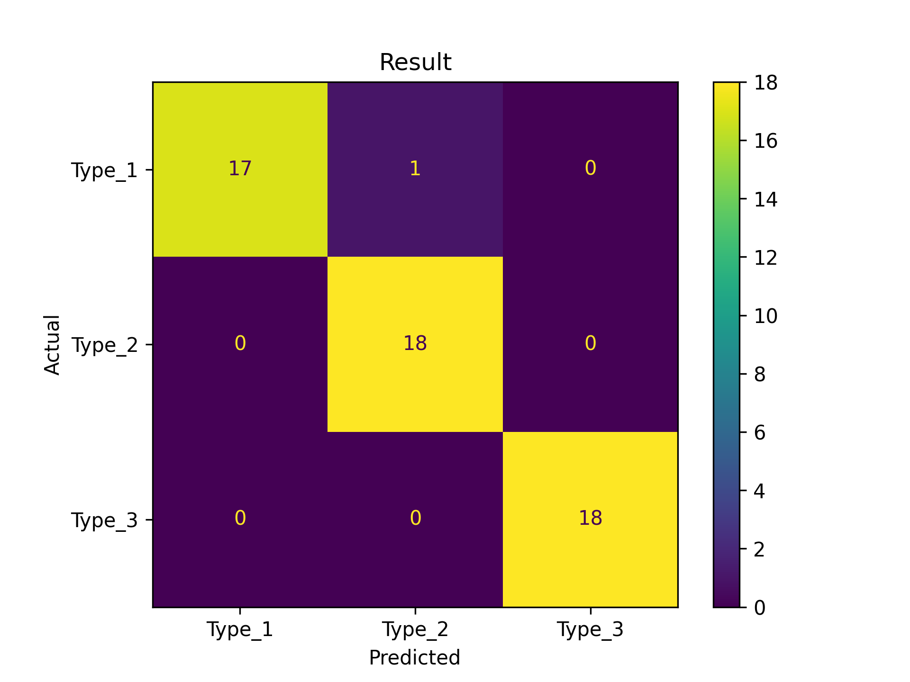
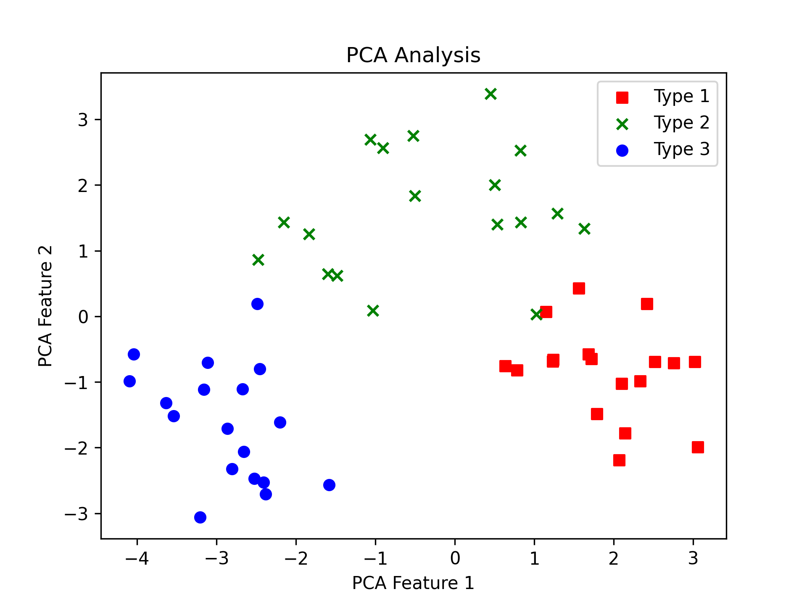

# ML Homework 1

<div style="text-align: right">106061210 林宗暐</div>


Classify 3 types of wines base on 13 features.


## Run

Simply prepare `Wine.csv` and `main.py` in the same directory, and run

``` shell
python3 main.py
```

The program will first generate `train.csv` with `test.csv`. Then, it will try to train a classifier base on data in `train.csv`. The classifier will be tested by data in `test.csv`. Finally, some analysis upon the training and testing data are performed.


## Calculate Posterior

Trying to build a model of type.

$$
T = \{t_1, t_2, t_3\} \\
X = \{x_1, x_2, \dots, x_n \},\ with\ x_i = (f_i^1, f_i^2, \cdots, f_i^k) \\
$$

For a new data $x_*$,

$$
max\{p(T | x_*) \} = \frac{p(x_*|T) p(T)}{p(x)} \\
$$

The prior probability $p(T)$ is the probability of $T=t_i$ without knowing infos of $x_*$. 

Let the number of instances of type $i$ is $n_i$ in the training data,
$$
p(T=t_i) = \frac{n_i}{\sum_i n_i}
$$

And the likelihood,

$$
p(x_* | T) = \Pi_k p(f_*^k | T)
$$

Since the features are independent and Gaussian distributed, I adopt the PDF and perfor integrate within a very small delta to get the probability.

$$
p(f_*^k | T) = \int_{f_*^k}^{f_*^k + \delta} N(y | \mu^k, \delta^k, T) dy
$$

<div style="page-break-after: always;"></div>

## Result

The classifier can acheived around 98% of accuricy, depending on different training and testing datasets.




## PCA Analysis

Surprised by the accuracy, I try to find the reason. Training the scaler and PCA with training data, and they're applied to testing data. 



The result above reveals that the useful information for classifying can be compressed to 2 dimensions. With the PCA analysis, the high accuracy can be expected.

P.S. Using PCA directly upon scaled testing data will get similar result.


## Effect of Prior

I try to set the prior to uniform distributed, and the accuracy drop to 96%.

```
Priors = {1: 0.33064516129032256, 2: 0.4274193548387097, 3: 0.24193548387096775}
Acc: 0.9814814814814815
Priors = {1: 0.3, 2: 0.3, 3: 0.3}
Acc: 0.9629629629629629
```


## Limitation

1. All the features need to be independent and the distribution of them is Gaussian.
2. MAP did not be applied to get the params of each features. I did want to try but run out of time.


