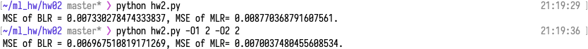
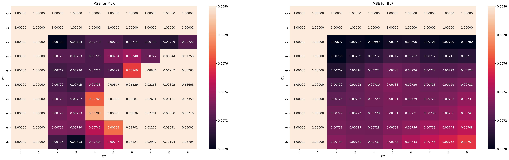
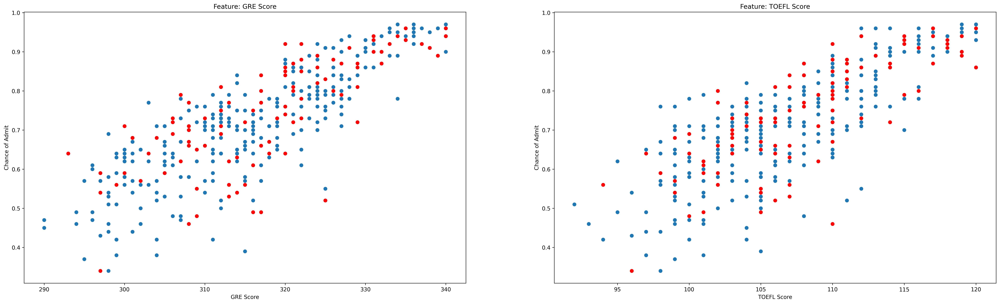
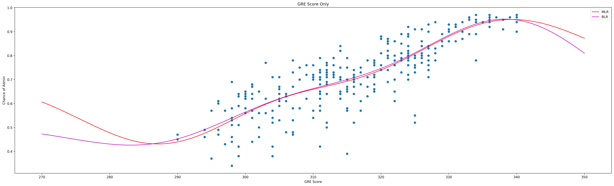
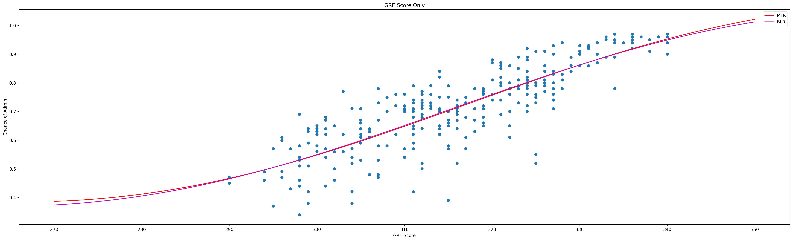

# ML Homework 2

Predict chance of admit by 3 features: GRE, TOEFL, Research Experience.

## Run

Place `Training_set.csv`, `Validation_set.csv`, and `hw2.py` in the same directory. Then,

``` shell
python3 hw2.py -O1 5 -O2 5
```

Default value of both O1 and O2 are 5. 

They are the number of location used in the Gaussian basis function for GRE and TOEFL scores, respectively.


## Result

For default O1 and O2:

```
MSE of BLR = 0.007330278474333837, MSE of MLR= 0.008770368791607561.
```

With O1 = 2, O2 = 2:

```
MSE of BLR = 0.006967510819171269, MSE of MLR= 0.0070037480455608534.
```




## Impact of O1 and O2

Both MLR and BLR suggest that O1 matters more than O2.



Larger O1 (O2) should give lower variance. It might reduce MSE for the test data that is very similar to the training data. On the other hand, it will make the model less general. In this task, the test data (red) does look similar to the training data (blue).




## Comparison

To compare MLR and BLR, I try to train the model with the GRE Score only, to better vitualize the result. By setting the TOEFL Score and the Research Experience to random, I get (O1=5, O2=2):



They will get more and more similar when O1 gets smaller (O1=2):



At the endpoints, the difference shows up. 

For small O1 i.e. not extending original features too much, the Bayesian Linear Regression seems to be a better choice for this task. The slope can remain positive at the left endpoint, just for a bit longer.

## Implementation

For forming the feature vector by the Gaussian basis function, I try to utilize the feature of numpy.

```python
# For training, i.e. scale and center are not given.
phi = np.zeros([np.shape(x)[0], O1*O2])
scale = (np.max(x,axis=0) - np.min(x,axis=0)) / np.array([O1-1, O2-1])
center = np.zeros([2, O1*O2])
for i in range(O1):
    for j in range(O2):
        center[:, O2*i+j] = scale * np.array([i,j]) + np.min(x,axis=0)
        dis = x - center[:, O2*i+j]
        dis_scaled = np.square(dis) / (2 * np.square(scale)).T
        phi[:, O2*i+j] = np.exp(-np.sum(dis_scaled, axis=1))
```

Then, the Research Experience and bias will be added to the last 2 elements of the feature vector. 

For Maximum Likelihood and Least Squares,
$$
w = \Phi^{\dagger} t, \ 
y = w^T \phi(x) \ .
$$

In out task, simply use:

```python
w = np.linalg.pinv(phi_train).dot(x[:, 3])
y = phi_test.dot(w)
```

Similarly, in Bayesian Linear Regression,

```python
y = phi_test.dot(m_N)
```

The problem will be how to calculate $m_N$. Let M be the number of features, N be the number of training data.
$$
\left . \begin{array}{l} 
S_N^{-1} &= \alpha I + \beta\Phi^T\Phi,\\
m_N      &= \beta S_N \Phi^T t,\\
\gamma   &= \sum_{j=1}^M \frac{\lambda_j}{\alpha+\lambda_j}, \\
\alpha   &= \frac{\gamma}{m_N^T m_N}, \\
\beta    &= \frac{N-\gamma}{\sum_{i=1}^N (t_i - m_N^T \phi(x_i))^2} 
\end{array} 
\right .
$$
That is:

1. Set initial value of $\alpha,\ \beta$ 
2. Calculate $S_N^{-1},\ m_N$ from $\alpha,\ \beta$
3. Calculate $\alpha,\ \beta$ from $S_N^{-1},\ m_N$
4. Go back to step 2 if the change in $\alpha,\ \beta$ still large.

<div style="page-break-after: always;"></div>
## References

http://krasserm.github.io/2019/02/23/bayesian-linear-regression/